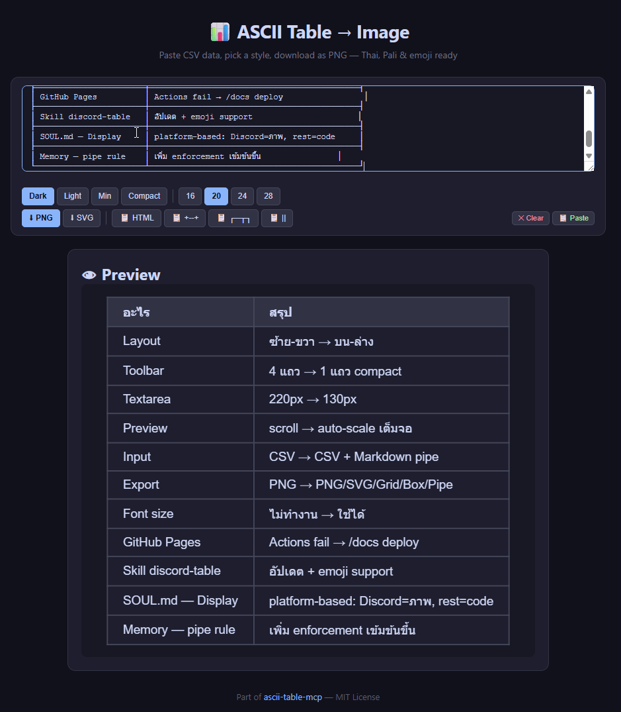
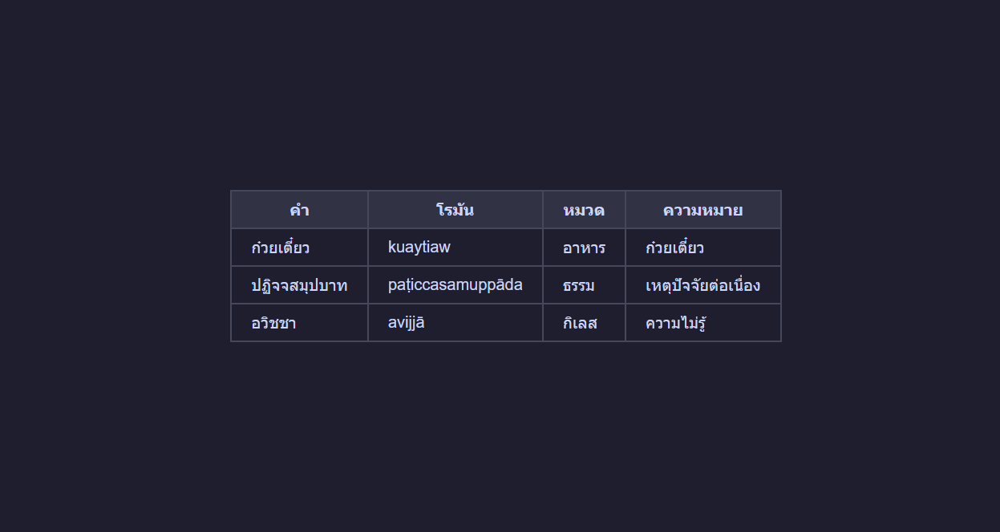
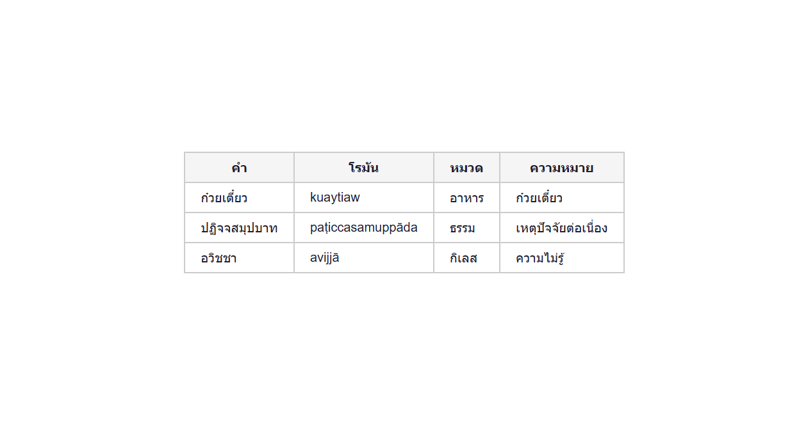
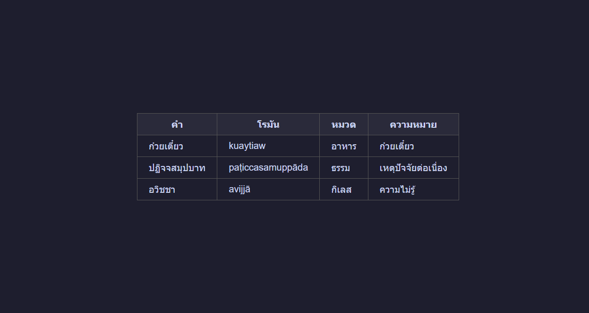
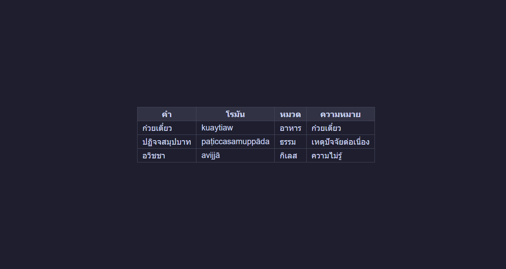

# ASCII Table MCP Server

**Beautiful tables in terminal code blocks AND as polished images — with native Thai, Pali, Roman, CJK, and emoji support.**

```text
+------------+------------------+--------+----------------------+
| Pali       | Roman            | Type   | Meaning              |
+------------+------------------+--------+----------------------+
| ปฏิจจสมุปฺปาท | paṭiccasamuppāda | Dhamma | Dependent origination |
| กามจฺฉนฺท    | kāmacchanda      | Nīvaraṇa | Sensual desire       |
| อวิชฺชา      | avijjā           | Kilesa | Ignorance            |
+------------+------------------+--------+----------------------+
```

*Thai + Roman + numbers → pixel-perfect alignment, every row.*

---

> 🌐 **Try it in your browser!** → [**ASCII Table → Image Generator**](https://dhammawatthumpra-coder.github.io/ascii-table-mcp/)<br>
> Paste CSV, pick a style, export as PNG / SVG / Grid / Box / Pipe. Thai + emoji ready. No install needed.



---

**Why this exists:** Most ASCII table libraries use `len()` in Python, which counts combining marks (like Thai tone marks, Devanagari vowel signs) as separate characters. This **breaks alignment** for any language with zero-width characters. This server uses `wcwidth` — the same library terminals use — so columns line up correctly, on every platform.

---

## Features

- **7 table formats**: `grid` (`+--+`), `box` (`┌─┬─┐`), `pipe` (`| | |`), `safe`, `html`, and more
- **10 grid sub-styles**: `mysql`, `separated`, `compact`, `gfm`, `reddit`, `rounded`, `rst`, `box`, `unicode`, `dots` — inspired by [ozh/ascii-tables](https://github.com/ozh/ascii-tables)
- **Auto-format**: auto-detects numeric columns (right-align) and centers headers
- **Thai / Pali / CJK / emoji**: zero-width combining marks (ิ, ี, ฺ, ◌̱, etc.) align perfectly
- **Safe width mode**: extra padding for platforms where zero-width marks ≠ zero (Discord, browser code blocks)
- **HTML image mode**: renders tables with Noto Sans Thai as beautiful PNG screenshots — perfect for chat apps
- **4 polished HTML styles**: `dark`, `light`, `minimal`, `compact`
- **CSV / TSV / JSON input**: convert from any data source
- **Debug tools**: `analyze_table`, `debug_table`, `validate_table_text` — find and fix alignment issues
- **Zero heavy dependencies** (only `mcp` + `wcwidth`)

---

## HTML Image Mode — Tables That Look This Good

For Discord, Telegram, Slack, or any place that can't render a proper monospace Thai table, use `fmt="html"` to generate a pixel-perfect screenshot instead.

| Style | Preview | Best for |
|-------|---------|----------|
| `dark` |  | Discord / Telegram dark mode |
| `light` |  | Documentation, PDF |
| `minimal` |  | Blog posts, websites |
| `compact` |  | Dense data, narrow screens |

```json
{
  "headers": ["Pali", "Roman", "Type", "Meaning"],
  "rows": [
    ["กมฺม", "kamma", "Noun", "action"],
    ["ญาณ", "ñāṇa", "Wisdom", "direct knowing"],
    ["ก๋วยเตี๋ยว", "kuaytiaw", "Food", "noodle soup"]
  ],
  "fmt": "html",
  "style": "dark"
}
```

→ Opens in browser → crop → paste as image. Simple, beautiful, cross-platform.

---

## Quick Start

### uvx (no install)

```bash
uvx --from git+https://github.com/dhammawatthumpra-coder/ascii-table-mcp ascii-table-mcp
```

### pip install

```bash
git clone https://github.com/dhammawatthumpra-coder/ascii-table-mcp.git
cd ascii-table-mcp
pip install -e .
python -m ascii_table_mcp
```

### Register with any MCP client

**Claude Desktop:**
```json
{
  "mcpServers": {
    "ascii-table": {
      "command": "python",
      "args": ["-m", "ascii_table_mcp"]
    }
  }
}
```

**Hermes:**
```bash
hermes mcp add ascii-table --command "python -m ascii_table_mcp"
```

---

## MCP Tools

### `make_table` — The main event

| Parameter | Type | Default | Description |
|-----------|------|---------|-------------|
| `headers` | `list[str]` | — | Column headers |
| `rows` / `data` | `list[list[str]]` | — | Data rows |
| `fmt` | `str` | `"grid"` | `"grid"`, `"box"`, `"pipe"`, `"safe"`, `"html"` |
| `style` | `str` | `"mysql"` | One of 10 grid styles or 4 HTML styles |
| `auto_format` | `bool` | `true` | Right-align numbers, center headers |
| `safe_width` | `bool` | `false` | Extra padding for Discord/browser |

**Example with `style="separated"`:**

```json
{
  "headers": ["Product", "Price", "Qty"],
  "rows": [
    ["Noodle Soup", "45", "3"],
    ["Fried Rice", "55", "2"]
  ],
  "fmt": "grid",
  "style": "separated"
}
```

```text
+============+======+=======+
|  Product   | Price |  Qty  |
+============+======+=======+
+------------+------+-------+
| Noodle Soup |   45 |     3 |
+------------+------+-------+
| Fried Rice  |   55 |     2 |
+------------+------+-------+
```

Notice: `auto_format=true` right-aligns `Price` and `Qty` columns, centers headers.

### `make_table_from_csv`

```json
{
  "csv_text": "Name,Role,Score\nAlice,Admin,95\nBob,User,87",
  "fmt": "grid"
}
```

### `make_table_from_json`

```json
{
  "json_data": "[[\"Term\",\"Meaning\"],[\"Kamma\",\"Action\"],[\"Dhamma\",\"Truth\"]]",
  "fmt": "box"
}
```

### Debug tools

- **`debug_table`** — shows exact char positions with drift analysis
- **`analyze_table`** — validates column alignment in `+--+` tables
- **`validate_table_text`** — structural check: column count, border alternation, format detection

---

## Thai Character Width: The Problem This Solves

Discord, browser code blocks, and some terminals **don't respect Unicode zero-width combining marks**.  
Characters like ` ิ` ` ี` ` ื` ` ู` ` ฺ` each take up width=1 on screen, but `wcwidth` says they're width=0.

```text
len("ก๋วยเตี๋ยว")   → 10  ← Python counts combining marks
wcwidth("ก๋วยเตี๋ยว") → 7   ← Reality: only 7 visible column positions
```

### Solution: `safe_width=True`

When enabled, the renderer uses `len()` (counts every character as width 1) instead of `wcwidth`, then adds padding for each combining mark:

```json
{
  "headers": ["Name", "Price"],
  "rows": [["ก๋วยเตี๋ยว", "45"]],
  "fmt": "grid",
  "safe_width": true
}
```

```text
+----------------+------+
|      Name      | Price |
+----------------+------+
| ก๋วยเตี๋ยว     |   45 |
+----------------+------+
```

Without `safe_width` (discord will misalign):

```text
+------------+------+
|    Name    | Price |
+------------+------+
| ก๋วยเตี๋ยว |   45 |  ← column drifts right by 3 chars
+------------+------+
```

### Future: Per-Character Width Database

`wcwidth` and `len()` are both approximations. A future plan is to build a **lookup table of actual display widths for each Thai character** on major platforms (Windows Discord, macOS Discord, Linux terminal) for 100% guaranteed alignment.

---

## Grid Styles Reference

| Style | Top border | Header sep | Data sep | Bottom | Notes |
|-------|-----------|-----------|----------|--------|-------|
| `mysql` | `+--+` | `+--+` | `+--+` | `+--+` | default |
| `separated` | `+==+` | `+==+` | `+--+` | `+--+` | bold header separator |
| `compact` | none | ` --- ` | none | none | frameless |
| `gfm` | none | `\|--\|` | none | none | GitHub Flavored Markdown |
| `reddit` | none | `--\|--` | none | none | Reddit tables |
| `rounded` | `.--.` | `:+:` | none | `'--'` | rounded corners |
| `rst` | `+==+` | `+--+` | `+==+` | `+==+` | reStructuredText |
| `box` | `┌┬┐` | `├┼┤` | `├┼┤` | `└┴┘` | Unicode box-drawing |
| `unicode` | `╔╦╗` | `╠╬╣` | `╠╬╣` | `╚╩╝` | double-line |
| `dots` | `┌┬┐` | `├┼┤` | none | `└┴┘` | no row separators |

### Format comparison

| Format | Example | Best for |
|--------|---------|----------|
| `grid` | `+----+----+` | Terminal, code review, GitHub |
| `box` / `safe` | `┌────┬────┐` | Presentation, formal docs |
| `pipe` | `\| \| \|` | Markdown-native |
| `grid` + `safe_width` | `+------+----+` | Discord, browser (zero-width ≠ 0) |
| `html` | HTML `<table>` | Screenshot-as-image for chat apps |

---

## CLI Usage

```bash
# CSV args → grid
python -m ascii_table_mcp.generate_table --grid 'Name,Age' 'Alice,30' 'Bob,25'

# TSV pipe → grid
printf 'Name\tAge\nAlice\t30\n' | python -m ascii_table_mcp.generate_table --tsv --grid

# JSON
python -m ascii_table_mcp.generate_table --json '{"headers":["A","B"],"rows":[["1","2"]]}' --grid
```

```text
+-------+-----+
| Name   | Age |
+-------+-----+
| Alice  | 30  |
| Bob    | 25  |
+-------+-----+
```

---

## Architecture

```text
ascii-table-mcp/
├── ascii_table_mcp/
│   ├── __init__.py       # MCP server entry (FastMCP)
│   ├── generate_table.py # Core rendering engine + HTML
│   └── thaiwidth.py      # Thai-aware display width
├── server.py             # Thin CLI wrapper
├── table_to_image.py     # HTML → screenshot helper
├── requirements.txt      # mcp + wcwidth
├── pyproject.toml         # uv/pip packaging
├── ascii-table-mcp.bat   # Windows launcher
├── LICENSE               # MIT
├── README.md             # This file (English)
├── README_TH.md          # Thai documentation
└── examples/
    ├── ex_dark.png
    ├── ex_light.png
    ├── ex_minimal.png
    └── ex_compact.png
```

---

## Why `wcwidth` Instead of `len()`?

```text
len("กมฺม")      → 4  ❌ (counts the dot-below as a character)
wcswidth("กมฺม") → 3  ✅ (dot-below is zero-width)
```

Using `len()` for table layout:

```text
+----------+-----------+   ← border width 8
| Pali     | Roman     |   ← "กมฺม" = 4 chars → padding 4 → total 9 ❌
+----------+-----------+
```

Using `wcwidth`:

```text
+---------+-----------+
| Pali    | Roman     |   ← "กมฺม" = width 3 → padding 5 → total 8 ✅
+---------+-----------+
```

---

## Related Projects

- [ozh/ascii-tables](https://github.com/ozh/ascii-tables) — original table style system
- [dmarsters/ascii-art-mcp](https://github.com/dmarsters/ascii-art-mcp) — decorative ASCII art
- [schachmat/wego](https://github.com/schachmat/wego) — Go terminal weather (go-runewidth)
- [wcwidth](https://pypi.org/project/wcwidth/) — Python wcwidth implementation

---

## License

MIT — free for personal and commercial use.
